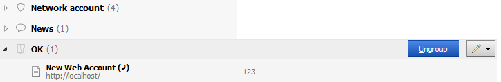
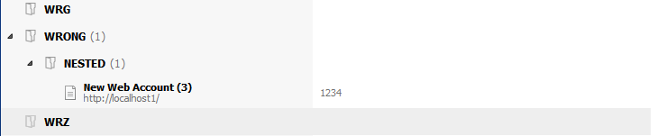
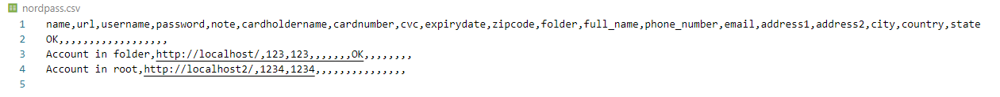

# Password exporter (Sticky Password to NordPass)

This script converts the exported xml data from [Sticky Password](https://www.stickypassword.com/) to readable format for [NordPass](https://nordpass.com/)

## System requirements

* Python 3.5, 3.6, 3.7, 3.8, 3.9

## How to use
Data from section "**Web Accounts**" should affinity two requirements! 
1. **Every account should be or in folder either in root section "Web Accounts"**
2. **Account in the folder shouldn't be accomodated another folder which nested.** 

**Summary!** **All accounts which you want move to NordPass should be located or in root section "Web Accounts" either in folder which doesn't contains nested folder.** 

 3. Export accounts in XML format from Sticky Password
 4. Unpack downloaded archive with script
 5. Change config.json, path to file exported from Sticky Password. 
    **Default path**: src/default.xml
 6. Run the script and wait for it to complete
 7. Check file in folder with script nordpass.csv, if it exists, you can import it into NordPass

## Example

Pic. 1 correct Sticky Password data structure

Pic. 2 not correct Sticky Password data structure

Pic. 3 correct NordPass data structure (Output file after script execution)
([Official article](https://support.nordpass.com/hc/en-us/articles/360002377217-How-to-organize-CSV-file-for-import-to-NordPass-))

After first string is followed by the group name (folder name), then data of accounts.
